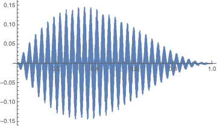

Code extracted from AngPow to perform the k-integration.

The purpose of the exercice is to perform the following integration 

```math
I = \int_{k_{Min}}^{k_{kMax}} g(k) f_\ell(k,R_1) f_\ell(k, R_2) dk
```
with

```math
f_\ell(k,R) = \cos( kR - \ell \pi/2 - \pi/4) 
```

and g(k) a common smooth part as for exemple

```math
g(k) = x(x-1)^2
```
(nb. here it is supposed implicitly that kmin=0, kmax=1).

Here is an example with R1=2000, R2=2200, ell=20



The user has to provide the function parameters, 
the  integral bounds kMin and kMax, 
the number of k-sub intervales, the chebyshev orders to perform Chebyshev 
transform of the two oscillatory functions which implies the dimension
of the final sampling order of the funtions and the associated Clenshaw-Curtis 
order. 

Please note that given a user chebyshev orders (see che1 and che2 command line)
then the first and second functions (ie f_\ell(k,R_1) f_\ell(k, R_2)) are sampled with 
N1=2^che1+1 and N2=2^che2+1 samples, 
and the common part (g) is sampled with N=2^che1+2^che2+1 samples. For instance
if che1 = che2 = 8, then N=513.

Then, on each k-sub interval, the chebyshev coefficients and their 
extensions to the final space dimension as well as the chebyshev inverse 
transform of the two oscillatory functions are computed separately. 
Knowing the final space dimension, the common smooth function is then sampled
and the resulting three vectors of samples are then multiplied to compute the integral 
on the k-sub interval

The "cos" product function leads to exact computation that can be used
as accuracy benchmark.

Test: after cloning the code, and ```FFTW``` installed

    > make
    > ./bin/3cint

Output

    Configuration parameters are set to: 
    ell=20, Nintervales=5
    Order of the final Chebyshev polynomial: 513
    Approx. Integ = -1.23899e-05
    True Integ = -1.23899e-05 diff= 3.58456e-16
    End test0......
    ---/ Fin bloc try ---- 
    ---- Programme 3cint.cc -  FIN  (Rc=0) --- 


